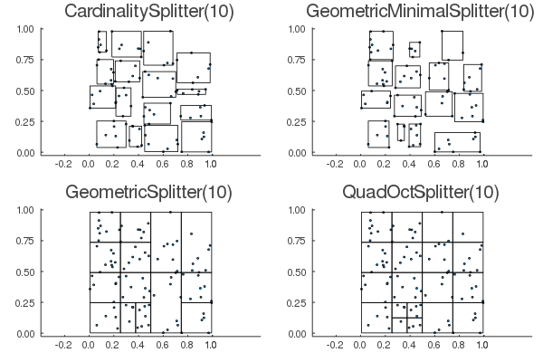
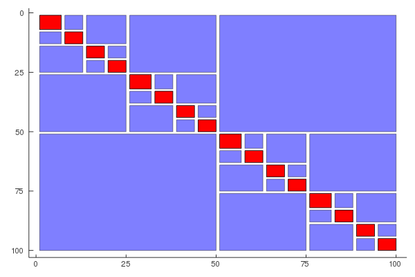
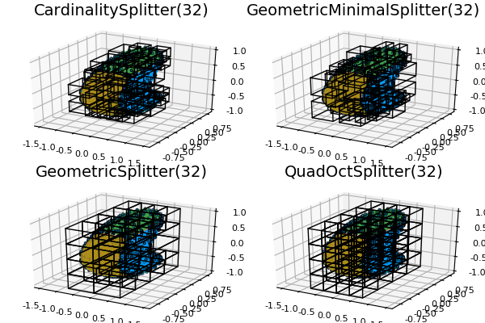

# Clusters.jl

*Cluster trees needed for integral equations* 


## Installation
Install from the Pkg REPL:
```
pkg> add https://github.com/maltezfaria/Clusters
```

## Usage

This package is mostly aimed at constructing the various cluster trees which are used in acceleration routines of boundary integral equations. Here is a summary of the clusters you can build:

```julia
    using Clusters, GeometryTypes, Plots
    pts = rand(Point{2,Float64},100)
    Splitters = subtypes(Clusters.AbstractSplitter)
    p = []
    for Splitter in Splitters
        spl = Splitter(nmax=10)
        clt = ClusterTree(pts,spl)
        push!(p,plot(clt,title=string(spl)))
    end
    plot(p...)
```
You should see something like this:



The other thing you want to do is to build a block cluster tree from the two cluster trees. This requires an admissibility condition, and the syntax looks something like this:

```julia
clustertree   = ClusterTree(pts,CardinalitySplitter(nmax=10))
adm           = WeakAdmissibilityStd()
blocktree     = BlockTree(clustertree,clustertree,adm)
plot(blocktree)
```
You should see something like this:



If you have added [ParametricSurfaces](https://github.com/IntegralEquations/ParametricSurfaces), a more interesting example is:
```julia
    using Clusters, ParametricSurfaces, Plots
    geo           = Bean()
    quad          = TensorQuadrature((10,10),geo)
    pts           = quad.nodes |> vec
    p = []
    for Splitter in Splitters
        spl = Splitter(nmax=10)
        clt = ClusterTree(pts,spl)
        push!(p,plot(clt,title=string(spl)))
    end
    plot(p...)
```
which should show something like this:


